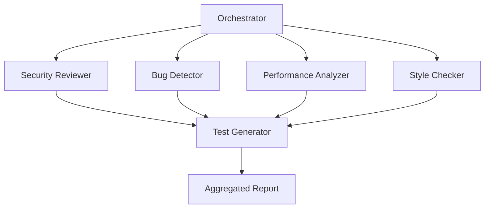

# Agent Architectures

## [01_multi_agent_orchestration](./01_multi_agent_orchestration.ipynb)

```mermaid
flowchart TD
A[Orchestrator] --> B[Security Reviewer]
A --> C[Bug Detector]
A --> D[Performance Analyzer]
A --> E[Style Checker]
B --> F[Test Generator]
C --> F
D --> F
E --> F
F --> G[Aggregated Report]
```
